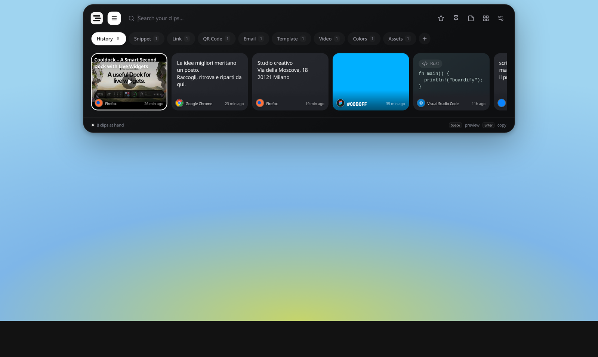
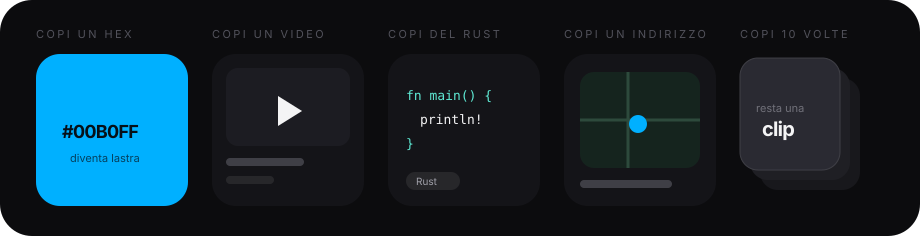
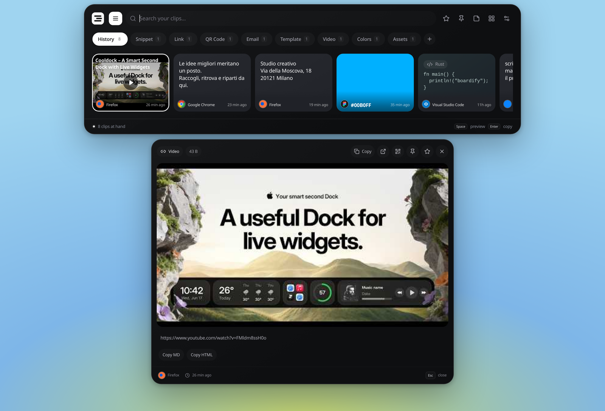
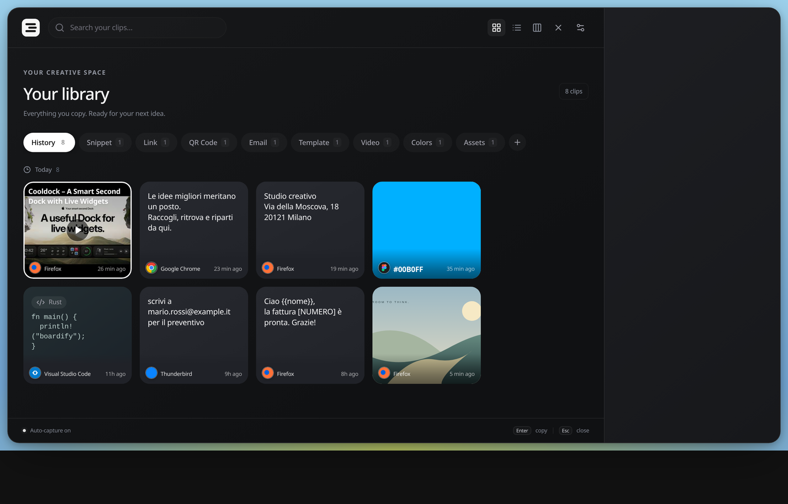
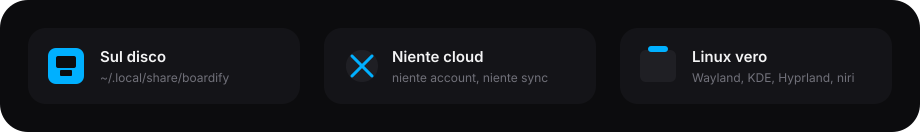

<h1 align="center">
  
</h1>

<p align="center">
  <strong>Clipboard manager visuale per Linux e Windows.</strong><br />
  Copi qualcosa, cade dallo shelf in cima. Locale, senza cloud,<br />
  clone spirituale di <a href="https://www.supaste.com/">Supaste</a> — per chi il Mac se lo sogna e il desktop se lo tiene.
</p>

<p align="center">
  
</p>

## Copi una cosa. Diventa un’altra.

Niente icone da libreria, niente elenco fisso di categorie. Quello che copi *diventa* la card giusta: lastra di colore, player, snippet, mappa. Se premi copia dieci volte di fila resta **una** clip.

<p align="center">
  
</p>

Le pill (Snippet, Link, QR, Email, Template, Video, Colors, Assets, File, e le tue) si accendono da sole quando hai davvero copiato quel tipo di cosa. Search con `@video @email @firefox`.

## Un click, le funzioni. Non la chiusura.

Sullo shelf il click apre la preview: YouTube/Vimeo, QR locale, Markdown/HTML, armonie HEX/RGB/HSL, mailto, mappe, path, template con `{{nome}}`. Doppio click o Invio copiano (e, se vuoi, nascondono).

<p align="center">
  
</p>

## La libreria è la memoria lunga

Card, lista o board. Pin, preferiti, combina, drag verso le altre app. Il dettaglio a destra è lo stesso cervello della preview, con più spazio.

<p align="center">
  
</p>

## Copi dieci volte. Un toast.

Niente spam. Una cattura, un toast in cima, chrome nero. Poi `Ctrl+V` come sempre — su Wayland non iniettiamo tasti.

<p align="center">
  
</p>

<p align="center">
  
</p>

Riconosce l’app di origine (Hyprland, niri, Sway, KDE, X11) e mette l’icona vera in basso a sinistra. Oscura password, token, carte. OCR e color picker se li hai installati.

## Tasti

<p align="center">
  
</p>

| Combinazione | Cosa fa |
| --- | --- |
| `Ctrl+Shift+V` | Shelf |
| `Ctrl+Shift+L` | Libreria |
| `Ctrl+Shift+0` … `9` | Incolla uno degli ultimi dieci |
| `Ctrl+Shift+N` | Quick note |
| `Ctrl+Shift+S` / `P` / `T` | Cattura manuale · colore · testo da schermo |

## Lancialo

```bash
npm install
npm run tauri dev
```

Dipendenze di sistema (Linux): `webkit2gtk-4.1`, `base-devel`, `openssl`, `appmenu-gtk-module`, `gtk3`, `librsvg`, `libvips`, `patchelf`, `tesseract`. Opzionali: `slurp`+`grim` o `spectacle` per il testo da schermo, `hyprpicker`/`kcolorchooser` per i colori. Su Windows bastano WebView2 (già nel sistema) e `tesseract` nel PATH per il testo da schermo; build con `npm run tauri build`.

Solo UI, dati finti, niente Tauri:

```bash
npm run dev
```

Typecheck e euristiche:

```bash
npx tsc --noEmit
cargo test --manifest-path src-tauri/Cargo.toml detect
```

Bundle: `npm run tauri build` → `src-tauri/target/release/bundle/`.

I clip vivono in `~/.local/share/boardify/clips.db`. Stack: Tauri v2 + Rust, React, Vite, Tailwind v4, Framer Motion, Zustand, SQLite WAL + FTS5.

## Screenshot del README

Quando cambi lo shelf, la preview o la libreria, rigenera i PNG (Chromium + ImageMagick):

```bash
npm run shots
```

Parte Vite su `127.0.0.1:1421`, congela le animazioni con `?shot=`, ritaglia il toast e scrive `docs/shots/{shelf,preview,library,capture}.png`.
